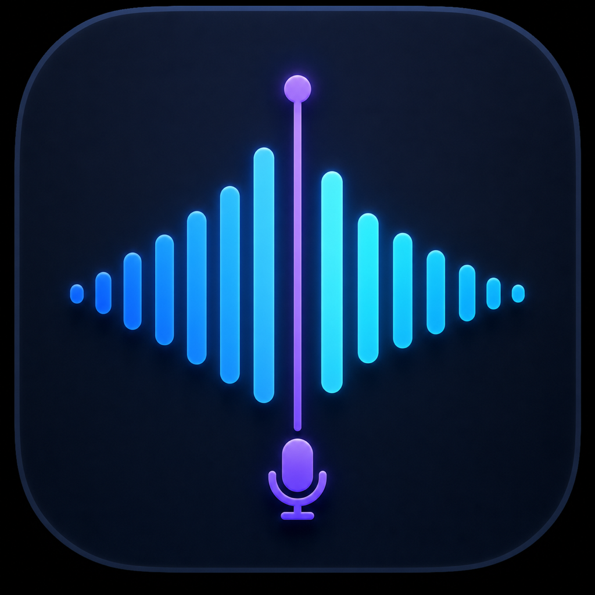

# MinuteMark

A small, native macOS menu-bar app that transcribes microphone and meeting
audio locally into Markdown. MinuteMark does not retain audio recordings.



## What it does

- Captures a selected microphone and system audio as separate streams
- Labels microphone speech as **You** and system audio as **Meeting**
- Shows progressive transcription in the menu-bar popover
- Writes finalized phrases directly to a Markdown file
- Uses the meeting title in the Markdown heading and a safe, sortable filename
- Supports English and German Apple speech models
- Supports automatic or manual input-channel selection for multi-channel
  audio interfaces
- Captures ordinary system audio from apps such as Zoom, Webex, Teams, and
  browsers

Audio exists only in memory while it is being transcribed. MinuteMark has no
account, cloud API, database, analytics, or bundled speech model.

## Requirements

- Apple silicon Mac
- macOS 26 or newer
- Xcode 26 or newer

## Build and run

```sh
make run
```

This creates and opens `build/MinuteMark.app`. The build script uses the first
available Apple Development signing identity so macOS privacy permissions
remain stable between builds. It falls back to ad-hoc signing if no development
identity is installed.

On first use, allow Microphone and Screen & System Audio Recording access.
The selected English or German Apple speech model may download once before
transcription begins.

## Use

- Left-click the menu-bar waveform to open the transcription controls.
- Right-click the icon for Settings or Quit.
- Open **Transcripts…** from the right-click menu to search and preview past
  Markdown notes in a clean library view.
- The transcript library updates automatically when notes are created, renamed,
  or moved to Trash.
- Move unwanted transcripts and their diagnostics logs to macOS Trash from the
  library toolbar or a note’s context menu.
- Select several transcripts with Command-click or Shift-click, then use the
  toolbar trash button or press Delete to move them to Trash together.
- Rename a transcript by editing its large preview title directly,
  double-clicking its list row, using the toolbar pencil, or choosing Rename
  from its context menu. The Markdown heading, safe filename, and diagnostics
  filename stay in sync.
- Choose language, then select **Start transcription**.
- Enter a title such as `Product planning`; the note will be named like
  `2026-07-31_104512_Product-planning.md`.
- Choose microphone, input-channel mode, and output folder in Settings.
- Select **Open note** to open the current Markdown file in TextEdit.

Notes are saved to `~/Documents/Meeting Notes` by default.

## Privacy

MinuteMark uses Apple's on-device `SpeechTranscriber`. It does not save or
upload audio.

The persistent output is:

- A Markdown transcript
- A local text diagnostics log containing timestamps, pipeline status, device
  configuration, and transcription results
- Local preferences for microphone, channel mode, and notes directory

Diagnostic logs are currently verbose because the app is in an MVP stage.

## Development

```sh
make test
make build
make app
```

The implementation uses:

- ScreenCaptureKit for system and microphone audio
- Two independent SpeechAnalyzer/SpeechTranscriber pipelines
- SwiftUI and AppKit for the menu-bar popover and native context menu
- Swift Package Manager for builds and tests

## Current status

Short transcription sessions with a Focusrite Scarlett 2i2 have been verified.
The app has not yet completed an eight-hour soak test. Long-session efficiency,
sleep/wake recovery, audio-device disconnection, and analyzer recovery still
need hardening before relying on it as the only transcript source for critical
meetings.
